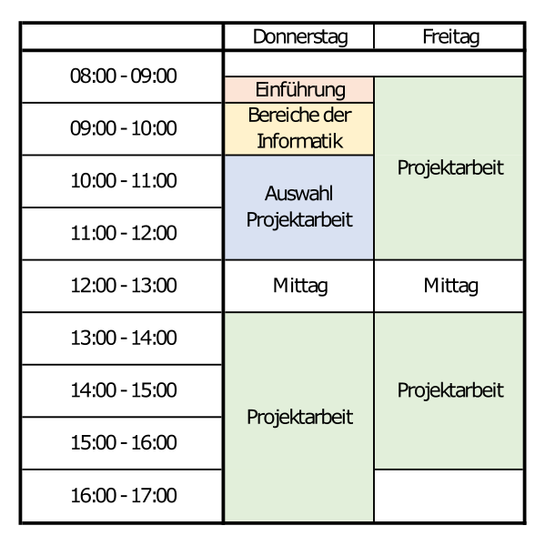

# Einführung

## eoscop AG
Als strategischer Partner der PostLogistics AG entwickelt die eoscop AG eine abdeckende Suite von kundenseitigen, sowie betriebsinternen Logistikapplikationen.
Die Applikationen sowie Dienstleistungen decken die Bereiche Entwicklung (Projektleitung und Programmierung für Web und Desktop), System- und Netzwerkadministration sowie technischer Support ab.

## Schnuppertage

Leitung:
- Mauro Frischherz

Schnupperlehrlinge:
- Janick Berger
- Gian Gunziger
- Linus Fuchs

## Zeitplan

# Bereiche der Informatik

## Softwareentwicklung
>Die Softwaretechnik oder Softwaretechnologie, englisch Software Engineering (SE), beschäftigt sich mit der Herstellung oder Entwicklung von Software, der Organisation und Modellierung der zugehörigen Datenstrukturen und dem Betrieb von Softwaresystemen. [[Wikipedia]](https://de.wikipedia.org/wiki/Softwaretechnik)

### Technologien und Programmiersprachen

- Web
  - Webseiten/WebApps wie youtube, gmail
  - C#, PHP, Javascript, Typescript, Java (uvm.)
- Mobile
  - Apps auf Smartphones oder Tablets (Android/iOS)
  - C#, Java, Swift, Objective-C (uvm.)
- Embedded
  - Software auf Geräten wie "Smart"-Staubsauger oder in IOT-Devices
  - C/C++, Rust (uvm.)
- Desktop
  - Programme welche auf Laptops oder Desktop-Maschinen (mac/windows/linux) laufen
  - C#, Java, Swift, Objective-C, C/C++, Rust

## Systemadministration
>Ein Systemadministrator (von lateinisch administrare „verwalten“; auch Administrator oder (formlos) Admin, Sysadmin, Netzwerkadministrator, Netzwerkverwalter, Netzadministrator, Netzverwalter, Systemmanager, Systemverwalter, Systembetreuer, Systemoperator, Operator oder Sysop (aus „Systemoperator“) genannt) verwaltet Computersysteme auf der Basis umfassender Zugriffsrechte auf das System.
>
>Systemadministratoren planen, installieren, konfigurieren und pflegen die informationstechnische Infrastruktur (IT-Infrastruktur) eines Unternehmens oder anderer Organisationen. Als Operatoren führen sie die zum laufenden Betrieb der Computeranlagen erforderlichen manuellen Tätigkeiten aus. [[Wikipedia]](https://de.wikipedia.org/wiki/Systemadministrator)

## Technischer Support
>- Der First-Level-Support (auch: Helpdesk) ist die erste Anlaufstelle für alle eingehenden Unterstützungsfragen. Der Mitarbeiter ist für deren vollständige Erfassung inklusive aller erforderlichen Zusatzinformationen zuständig und bearbeitet sie nach seinem Kenntnisstand weitestgehend selbstständig. Ziele sind die Vorauswahl der Probleme und das schnelle Lösen einer möglichst großen Anzahl, was durch Zuhilfenahme von Wissensdatenbanken ermöglicht werden kann. Unterstützung erhält der First-Level-Support durch den Second-Level-Support.
>
>- Der Second-Level-Support unterstützt den First-Level-Support, sowohl durch Weiterbildung am Arbeitsplatz (engl.: training-on-the-job) als auch durch Übernahme komplexerer Anfragen. Neu erarbeitete Lösungen werden in Wissensdatenbanken eingepflegt, um das Wissen für den First-Level-Support nutzbar zu machen. Übersteigt die Komplexität einer Anfrage das Know-how oder die technischen Möglichkeiten des Second-Level-Supports, so wird diese an den Third-Level-Support weitergeleitet („eskaliert“). Auch Tickets, deren Lösung einen Eingriff in die Programmlogik oder in Daten der Datenbank erfordert, werden an den Third-Level-Support weitergeleitet.
>
>- Der Third-Level-Support setzt sich aus Spezialisten einzelner Fachabteilungen oder des Herstellers zusammen und stellt so die höchste Eskalationsstufe innerhalb einer Support-Organisation dar.
> [[Wikipedia]](https://de.wikipedia.org/wiki/Support_(Dienstleistung))