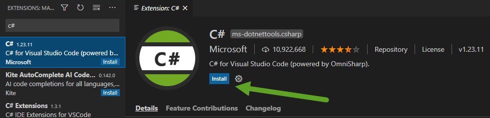
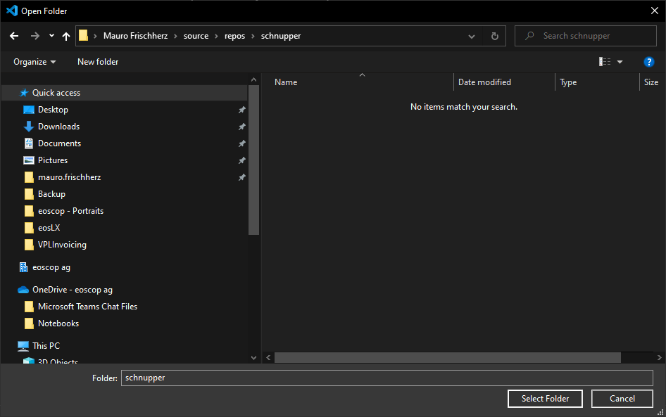
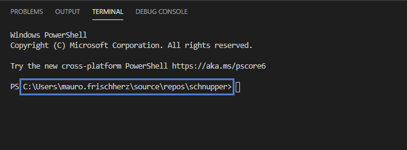

# Projekt A - Programmierumgebung

Als erstes richten wir die Umgebung ein, um ein Programm überhaupt schreiben zu können.
Dazu verwenden wir eine IDE ([Integrated Development Environment](https://de.wikipedia.org/wiki/Integrierte_Entwicklungsumgebung)). Es gibt eine grosse Auswahl an IDEs, in unserem Fall verwenden wir [Visual Studio Code](https://code.visualstudio.com/).

Als Programmiersprache für unsere Projekte werden wir C# verwenden.
>[C# in Visual Studio Code](https://code.visualstudio.com/docs/languages/csharp)

## Visual Studio Code und dotnet SDK installieren

1. Lade den Installer für Visual Studio Code herunter: [https://code.visualstudio.com/](https://code.visualstudio.com/)
2. Starte den Installer aus dem Download-Verzeichnis und installiere Visual Studio Code
3. Installiere die dotnet core SDK (Version 5): [https://dotnet.microsoft.com/download](https://dotnet.microsoft.com/download)
3. Öffne Visual Studio Code
4. Gehe zu Menü "View" -> "Extensions"
5. In der Suche oben Links eingeben: C#
6. Ersten Eintrag in der Liste wählen und installieren 

## Ein erstes Projekt erstellen und ausführen

Ist die Umgebung korrekt installiert, können wir nun unser erstes Programm erstellen.

Dazu sind folgende Schritte notwendig:

1. Im Explorer ein Verzeichnis erstellen, in welches das Projekt gespeichert werden soll. Ein Beispiel auf Windows wäre: 

`C:\Users\mauro.frischherz\source\repos\schnupper`

2. In Visual Studio Code auf "File" -> "Open Folder" und anschliessend zum neu erstellten Ordner navigieren. 
3. Nun öffnen wir ein neues "Terminal" über den Menüpunkt: "Terminal" -> "New Terminal". Dies zeigt uns nun eine Kommandozeile am unteren Rand der Applikation an. Diese Kommandozeile ist bereits im richtigen Ordner "schnupper": 
4. In diesem Terminal geben wir einen Befehl ein, welcher ein neues C# dotnet Projekt erzeugt, inkl. aller nötigen Grunddaten: 
```
dotnet new console -o HalloWelt
```
5. Wenn wir im Explorer nachschauen, wurde ein neuer Ordner "HalloWelt" erstellt.
6. Im Terminal wechseln wir nun vom Ordner "schnupper" in den Ordner "HalloWelt" mit dem Befehl:
```
cd HalloWelt
```
7. In diesem Ordner können wir nun die erstellte Applikation ausführen mit:
```
dotnet run
```
Dies sollte folgenden Output generieren:
```
PS C:\Users\mauro.frischherz\source\repos\schnupper\HalloWelt> dotnet run
Hello World!
```

Die Schritte 4 - 7 sollten für alle neuen Projekte durchgeführt werden.

## Programmcode

```csharp
using System;

namespace HalloWelt
{
    class Program
    {
        static void Main(string[] args)
        {
            Console.WriteLine("Hello World!");
        }
    }
}
```

Unser Programm ist komplett in der Datei `Program.cs` enthalten. Für grössere Projekte werden einzelne Programmteile in mehrere Dateien aufgeteilt, um Übersichtlichkeit zu gewährleisten. Für unsere kleinen Applikationen genügt jedoch eine Datei.

Interessant für uns ist der Abschnitt innerhalb der innersten, geschweiften Klammern.

```csharp
static void Main(string[] args) 
{
    Console.WriteLine("Hello World!");
}
```

Hier ist der komplette Ablauf des Programms ersichtlich. Das Programm führt einzig die **Methode** `WriteLine` der **Klasse** `Console` mit dem **Parameter** `"Hello World!"` aus.

Ab .Net Core 5 ist es möglich das Programm mit [Top Level Statements](https://docs.microsoft.com/en-us/dotnet/csharp/whats-new/tutorials/top-level-statements) zu schreiben. Somit fällt die Klassendefinition komplett weg und der Code kann folgendermassen geschrieben werden:
```csharp
using System;

Console.WriteLine("Hello World!");
```

## Aufgabe

Das Programm soll anstatt 

`Hello World!`

die Zeichenfolge
 
`Hallo Welt!`
 
ausgeben.